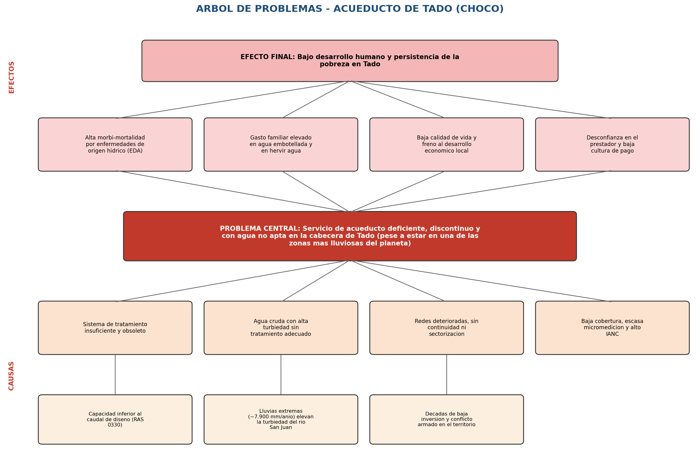
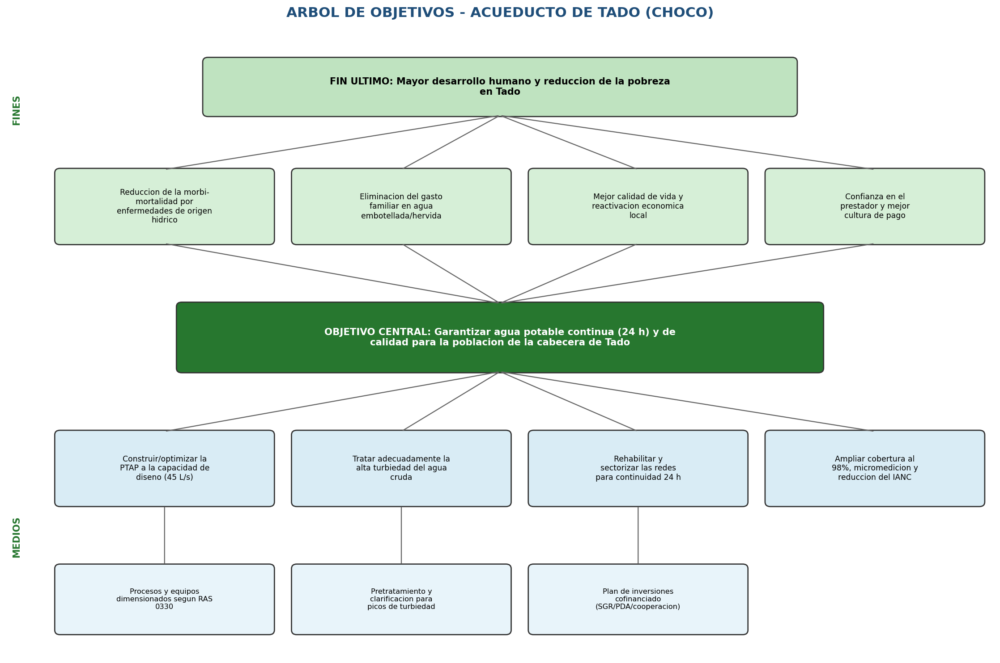

# PROYECTO PEPI — Optimización y ampliación del sistema de acueducto del municipio de Tadó (Chocó)

**Asignatura:** Preparación y Evaluación de Proyectos de Ingeniería (PEPI)
**Caso de estudio:** Municipio de Tadó, departamento del Chocó, Colombia (caso real)
**Cifras monetarias:** millones de pesos colombianos (COP MM) salvo indicación contraria
**Horizonte de evaluación:** 25 años

> **Nota de transparencia académica.** Este informe usa **datos reales y verificables** del municipio de Tadó (población DANE, fuente hídrica, clima, contexto socioeconómico y el proyecto real de acueducto financiado por MinVivienda y la cooperación española). Los parámetros que **no** provienen de una fuente oficial específica (desglose detallado del presupuesto por capítulos, tarifas, IANC, beneficios sociales) son **estimaciones razonables** debidamente señaladas. Todas las fuentes se listan en la sección 10.

---

## 1. Resumen ejecutivo

Tadó es un municipio del occidente del Chocó, sobre el **río San Juan**, con **17.000 habitantes** según el Censo Nacional de Población y Vivienda 2018 (DANE) y uno de los regímenes de lluvia más altos del planeta (~7.900 mm/año). Pese a esa abundancia de agua, la población históricamente ha carecido de **agua potable continua y de calidad**: el sistema de acueducto presentaba baja cobertura, discontinuidad y tratamiento insuficiente frente a la alta turbiedad del agua cruda durante las crecientes.

El proyecto consiste en **optimizar y ampliar el sistema de acueducto** de la cabecera urbana —incluida una **PTAP dimensionada para 45 L/s** según la Resolución 0330 de 2017 (RAS)— para alcanzar **continuidad 24 horas y cobertura cercana al 98%**, en línea con el objetivo del proyecto real ejecutado por el Ministerio de Vivienda, Ciudad y Territorio (MinVivienda) con cooperación española.

**Cifras clave (cálculo propio, modelo paramétrico):**

| Indicador | Valor |
|---|---|
| Caudal de diseño (QMD, Res. 0330) | **41,5 L/s** → PTAP de **45 L/s** |
| CAPEX total (anclado a la inversión real) | **COP 19.971 MM** |
| Estructura de financiación | 80% aporte público / 10% deuda / 10% equity |
| WACC | **9,31%** |
| VPN del proyecto "puro" (solo tarifas) @WACC | **−15.487 MM** (negativo) |
| TIR del inversionista (con aporte público) | **10,46%** |
| VPN socioeconómico @ tasa social 9% (DNP) | **+19.626 MM** |
| Relación Beneficio/Costo (social) | **1,56** |

**Conclusión.** Como ocurre con casi todos los acueductos municipales pequeños en Colombia, **el proyecto NO es rentable solo con tarifas** (VPN financiero negativo). Su justificación es **socioeconómica**: con una tasa social del 9% (DNP) el VPN es ampliamente positivo y la relación beneficio/costo es 1,56. Por eso este tipo de proyectos se **cofinancian con recursos públicos** (Sistema General de Regalías, Plan Departamental de Aguas, SGP y cooperación internacional), exactamente como sucedió en Tadó.

---

## 2. Árbol de problemas

El problema central es el **servicio de acueducto deficiente, discontinuo y con agua no apta** en la cabecera de Tadó. Sus **causas** (parte inferior) y **efectos** (parte superior) se representan en el esquema:



**Lectura del árbol:**
- **Efecto final:** bajo desarrollo humano y persistencia de la pobreza.
- **Efectos directos:** alta morbi-mortalidad por Enfermedad Diarreica Aguda (EDA), elevado gasto familiar en agua embotellada/hervida, freno al desarrollo económico y desconfianza en el prestador.
- **Problema central:** servicio de acueducto deficiente pese a estar en una de las zonas más lluviosas del planeta (paradoja del agua).
- **Causas directas:** sistema de tratamiento insuficiente, alta turbiedad del agua cruda no tratada, redes deterioradas sin continuidad, baja cobertura y micromedición.
- **Causas estructurales:** capacidad inferior al caudal de diseño, lluvias extremas que elevan la turbiedad del río San Juan, y décadas de baja inversión y conflicto armado en el territorio.

---

## 3. Árbol de objetivos

Es el "espejo" positivo del árbol de problemas: cada problema se convierte en un objetivo (fin/medio).



**Lectura del árbol:**
- **Fin último:** mayor desarrollo humano y reducción de la pobreza.
- **Fines:** reducción de morbi-mortalidad por EDA, eliminación del gasto en agua alterna, reactivación económica y confianza en el prestador.
- **Objetivo central:** garantizar **agua potable continua (24 h) y de calidad** para la cabecera de Tadó.
- **Medios:** construir/optimizar la PTAP a 45 L/s, tratar adecuadamente la alta turbiedad, rehabilitar y sectorizar las redes, ampliar cobertura al 98% con micromedición.
- **Medios fundamentales:** procesos dimensionados según RAS 0330, pretratamiento para picos de turbiedad, y plan de inversiones cofinanciado.

---

## 4. Matriz de Marco Lógico (MML)

| Nivel | Resumen narrativo | Indicadores | Medios de verificación | Supuestos |
|---|---|---|---|---|
| **Fin** | Contribuir al desarrollo humano y a la reducción de la pobreza en Tadó | IPM municipal; cobertura de necesidades básicas de agua | DANE (IPM), TerriData, Plan de Desarrollo Municipal | Estabilidad institucional y de orden público en el territorio |
| **Propósito** | La población de la cabecera de Tadó dispone de agua potable continua y de calidad | Continuidad ≥ 24 h/día; IRCA ≤ 5 (apta); cobertura ≥ 98% | Reportes SUI/Superservicios; informes IRCA (Sec. de Salud) | La comunidad se conecta y paga la tarifa; sostenibilidad del operador |
| **Componente 1** | PTAP construida/optimizada a la capacidad de diseño | Capacidad instalada = 45 L/s; pruebas de calidad de agua tratada | Acta de obra; certificación de la interventoría | Suministro eléctrico y de insumos químicos estable |
| **Componente 2** | Redes de aducción, conducción y distribución rehabilitadas y sectorizadas | km de red renovada; presión y continuidad por sector; IANC ≤ 25% | Catastro de redes; mediciones de presión/caudal | Disponibilidad de predios y servidumbres |
| **Componente 3** | Micromedición y conexiones domiciliarias ampliadas | N.º de micromedidores instalados; nuevas conexiones | Inventario del operador; SUI | Aceptación social de la micromedición |
| **Actividades** | Estudios y diseños; obras civiles; suministro/montaje de equipos; interventoría; gestión ambiental y social | Avance físico y financiero (%); cumplimiento del cronograma | Informes de interventoría; ejecución presupuestal | Recursos cofinanciados desembolsados a tiempo (SGR/PDA/cooperación) |

---

## 5. Solución de ingeniería propuesta

### 5.1 Diseño de caudal (Resolución 0330 de 2017 — RAS)

La Resolución 0330 de 2017 del MinVivienda es el Reglamento Técnico del Sector de Agua Potable y Saneamiento Básico (RAS) vigente y fija la metodología de diseño:

**Población de diseño (método geométrico):**
- Población municipio (CNPV 2018, DANE): 17.000 hab.
- Fracción urbana (estimada): 60% → población urbana base ≈ **10.957 hab (2024)**.
- Tasa de crecimiento: 1,2% anual (bajo, típico del Chocó).
- Periodo de diseño: 25 años → **población de diseño ≈ 14.764 hab**.

**Dotación (Art. 43, clima cálido < 1.000 m s.n.m.):**
- Dotación neta máxima: **140 L/hab·día**.
- Pérdidas técnicas máximas admisibles: **25%** (Art. 44).
- Dotación bruta = 140 / (1 − 0,25) = **186,7 L/hab·día**.

**Coeficientes de consumo (Art. 47):**
- k1 (máximo diario) = **1,30**
- k2 (máximo horario, red menor de distribución) = **1,60**

**Caudales resultantes:**

| Caudal | Fórmula | Valor |
|---|---|---|
| Medio diario (Qmd) | Pob · Dot.bruta / 86.400 | **31,9 L/s** |
| Máximo diario (QMD) | Qmd · k1 | **41,5 L/s** |
| Máximo horario (QMH) | QMD · k2 | **66,4 L/s** |
| **Capacidad PTAP seleccionada** | — | **45 L/s** |

La PTAP se dimensiona para el caudal máximo diario (41,5 L/s) y se selecciona una capacidad nominal de **45 L/s** que deja margen y normaliza el tamaño de equipos.

### 5.2 Esquema del sistema

1. **Captación (bocatoma)** sobre el río San Juan, con dispositivos para manejo de crecientes y sólidos gruesos.
2. **Línea de aducción** hasta la PTAP.
3. **PTAP convencional de 45 L/s** con tren de tratamiento robusto frente a **alta turbiedad** (la lluvia extrema y las crecientes elevan los sólidos suspendidos): pretratamiento/desarenado → coagulación-floculación → sedimentación → filtración → desinfección. El cumplimiento de calidad se verifica con el **IRCA** según la **Resolución 2115 de 2007**.
4. **Almacenamiento (tanques)** y **estaciones de bombeo** para garantizar presión y continuidad.
5. **Redes de distribución** rehabilitadas y **sectorizadas**, con **micromedición** para reducir el Índice de Agua No Contabilizada (IANC).

### 5.3 Presupuesto / CAPEX por capítulos

El CAPEX total se **ancla a la inversión real** del proyecto MinVivienda + cooperación española en Tadó: **COP 19.971 MM** (que incluyó ampliación del acueducto por fases y optimización del alcantarillado). El desglose por capítulos es una **estimación** consistente con ese total y con el alcance del proyecto:

| Capítulo | COP MM |
|---|---:|
| Captación (bocatoma) y línea de aducción | 2.400 |
| PTAP 45 L/s (obra civil + equipos) | 6.300 |
| Almacenamiento (tanques) y estaciones de bombeo | 2.800 |
| Redes de distribución, conexiones y micromedición | 4.200 |
| Optimización del alcantarillado (componente asociado) | 2.471 |
| Estudios, diseños, interventoría y gestión ambiental/social | 1.800 |
| **TOTAL CAPEX** | **19.971** |

> En un APU real, cada capítulo se descompone en ítems con cantidades, análisis de precios unitarios (mano de obra, materiales, equipo, transporte) y AIU. Aquí se presenta a nivel de capítulos por ser un caso académico; el modelo permite sustituir el total por el de un presupuesto detallado y recalcular todo automáticamente.

---

## 6. Análisis financiero

### 6.1 Estructura de financiación y WACC

Los acueductos municipales pequeños **no se financian con deuda pura**: dependen de **aportes públicos no reembolsables** (SGR, PDA del Chocó, SGP, cooperación). Se adopta la estructura típica:

| Fuente | % | COP MM | Costo |
|---|---:|---:|---|
| Aporte público (SGR/PDA/MinVivienda/cooperación) | 80% | 15.977 | tasa social 9% |
| Deuda (banca de desarrollo, p. ej. FINDETER) | 10% | 1.997 | Kd = 11% |
| Equity (operador/municipio) | 10% | 1.997 | Ke = 14% |

**WACC** (el costo de oportunidad del aporte público se toma como la tasa social del DNP, 9%; la deuda incluye escudo fiscal con tasa de renta 35%):

```
WACC = 0,80·9% + 0,10·14% + 0,10·11%·(1−0,35) = 9,31%
```

### 6.2 Indicadores y flujos

Supuestos operativos (estimados, realistas para ~2.700 conexiones estrato 1–2 subsidiadas):
- Ingreso por tarifa año 1: COP 1.500 MM (crece 3,5%/año).
- OPEX año 1: COP 1.150 MM (energía de bombeo, químicos, personal, mantenimiento; crece 3,5%/año).
- Depreciación lineal del CAPEX a 25 años. Renta 35%. Deuda a 10 años (sistema francés).

| Evaluación | Resultado |
|---|---|
| **1) Financiera del proyecto** (a costo total, solo tarifas) | VPN(@WACC) = **−15.487 MM**, TIR = **−2,45%** |
| **2) Del inversionista** (solo arriesga deuda+equity) | VPN(@Ke) = **−730 MM**, TIR = **10,46%** |
| **3) Socioeconómica** (tasa social 9% DNP) | VPN(@9%) = **+19.626 MM**, B/C = **1,56** |

**Flujos de caja (COP MM) — extracto:**

| Año | Ingresos | OPEX | EBITDA | FC Proyecto | FC Inversionista | FC Banco | Benef. social | FC Social |
|---:|---:|---:|---:|---:|---:|---:|---:|---:|
| 0 | — | — | — | −19.971 | −1.997 | +1.997 | — | −19.971 |
| 1 | 1.500 | 1.150 | 350 | 350 | 11 | −339 | 4.150 | 3.000 |
| 5 | 1.721 | 1.320 | 402 | 402 | 63 | −339 | 4.762 | 3.443 |
| 10 | 2.044 | 1.567 | 477 | 477 | 138 | −339 | 5.656 | 4.089 |
| 15 | 2.428 | 1.862 | 567 | 567 | 567 | 0 | 6.718 | 4.856 |
| 20 | 2.884 | 2.211 | 673 | 673 | 673 | 0 | 7.978 | 5.768 |
| 25 | 3.425 | 2.626 | 799 | 799 | 799 | 0 | 9.476 | 6.850 |

*(La tabla completa año a año está en `resultados_modelo.csv` y en la hoja "Flujos de Caja" del Excel.)*

### 6.3 Análisis de sensibilidad — aporte público vs. TIR del inversionista

| Aporte público | TIR inversionista |
|---:|---:|
| 0% | −5,40% |
| 40% | −1,46% |
| 60% | +2,18% |
| 70% | +5,20% |
| 80% | **+10,46%** |
| 90% | +25,18% |

**Lectura:** sin aporte público el proyecto es inviable para cualquier inversionista (TIR negativa). El proyecto solo resulta atractivo para un operador privado con **aporte público muy alto (≥85–90%)**, o bien debe ser operado por una empresa **pública/comunitaria** que no exige una rentabilidad del 14%. Esto explica por qué en la realidad lo financió MinVivienda con cooperación internacional.

### 6.4 Evaluación socioeconómica (la decisiva)

Beneficios sociales anuales (precios económicos, año 1; crecen con la cobertura):
- Ahorro en agua alterna (embotellada/hervida que hoy compran las familias): **COP 2.800 MM/año**.
- Reducción de costos en salud por EDA evitada (atención + productividad): **COP 900 MM/año**.
- Valor del tiempo liberado por acarreo de agua: **COP 450 MM/año**.

Descontados a la **tasa social del 9% (DNP)**:
- VPN económico = **+19.626 MM**
- Relación **Beneficio/Costo = 1,56** (cada peso invertido genera 1,56 pesos de beneficio social).

→ El proyecto es **socialmente rentable** y plenamente justificable como inversión pública, coherente con el estándar internacional (la OMS documenta retornos del orden de 1 a 4 dólares por cada dólar invertido en agua y saneamiento).

---

## 7. Matriz de riesgos (20 riesgos)

Probabilidad (P) e Impacto (I) en escala 1–5; Severidad = P × I. Nivel: Bajo (1–6), Medio (8–12), Alto (15–25).

| # | Tipo | Riesgo | P | I | P×I | Nivel |
|---:|---|---|:--:|:--:|:--:|---|
| 1 | Ambiental | Crecientes/turbiedad extrema del río San Juan superan la capacidad de la PTAP | 4 | 5 | 20 | Alto |
| 2 | Ambiental | Contaminación de la fuente por minería ilegal (mercurio) aguas arriba | 4 | 5 | 20 | Alto |
| 3 | Ambiental | Inundaciones que dañan captación/redes | 4 | 4 | 16 | Alto |
| 4 | Ambiental | Deforestación de la cuenca que altera el régimen hídrico | 3 | 3 | 9 | Medio |
| 5 | Ambiental | Vertimientos de aguas residuales no tratadas a la fuente | 3 | 4 | 12 | Medio |
| 6 | Social | Resistencia comunitaria a la micromedición/tarifa | 3 | 3 | 9 | Medio |
| 7 | Social | Baja cultura de pago y cartera morosa | 4 | 3 | 12 | Medio |
| 8 | Seguridad | Presencia de grupos armados (extorsión, retrasos de obra) | 4 | 4 | 16 | Alto |
| 9 | Institucional | Demora en desembolsos de cofinanciación (SGR/PDA) | 4 | 4 | 16 | Alto |
| 10 | Institucional | Debilidad del operador municipal (gestión, facturación) | 3 | 4 | 12 | Medio |
| 11 | Financiero | Sobrecostos por inflación de insumos/transporte | 3 | 3 | 9 | Medio |
| 12 | Financiero | Tarifa insuficiente para cubrir OPEX (subsidios cruzados) | 4 | 3 | 12 | Medio |
| 13 | Técnico | Diseño hidráulico subdimensionado frente a picos | 2 | 4 | 8 | Medio |
| 14 | Técnico | Fallas de equipos de bombeo por mantenimiento deficiente | 3 | 3 | 9 | Medio |
| 15 | Técnico | Suministro eléctrico inestable que detiene la PTAP | 3 | 4 | 12 | Medio |
| 16 | Operativo | Alto IANC por fugas no detectadas | 3 | 3 | 9 | Medio |
| 17 | Logístico | Dificultad de acceso por mal estado de vías (Chocó) | 4 | 3 | 12 | Medio |
| 18 | Ambiental | Escasez de insumos químicos (coagulantes) | 2 | 3 | 6 | Bajo |
| 19 | Legal | Demoras en predios/servidumbres | 3 | 3 | 9 | Medio |
| 20 | Salud pública | Brote de EDA durante la transición de obra | 2 | 4 | 8 | Medio |

---

## 8. Intervención de 10 riesgos (5 ambientales) y recalificación

Se intervienen los 10 riesgos de mayor severidad (incluidos **5 ambientales**), con medidas de mitigación y su **recalificación** (severidad residual).

| # | Riesgo | Tipo | P×I inicial | Medida de intervención | P×I residual | Nuevo nivel |
|---:|---|---|:--:|---|:--:|---|
| 1 | Turbiedad extrema del río San Juan | Ambiental | 20 | Pretratamiento robusto + sedimentadores de alta tasa + dosificación automática de coagulante + tanque de regulación | 8 | Medio |
| 2 | Contaminación por minería ilegal (mercurio) | Ambiental | 20 | Monitoreo de calidad de fuente + carbón activado + articulación con autoridad ambiental (CODECHOCÓ) y control de minería | 9 | Medio |
| 3 | Inundaciones que dañan captación/redes | Ambiental | 16 | Captación elevada/protegida + obras de protección de orillas + redes con cotas seguras | 8 | Medio |
| 5 | Vertimientos a la fuente | Ambiental | 12 | Componente de optimización de alcantarillado + campañas + coordinación municipal | 6 | Bajo |
| 4 | Deforestación de la cuenca | Ambiental | 9 | Pago por servicios ambientales + reforestación de la microcuenca con la comunidad | 4 | Bajo |
| 8 | Grupos armados / inseguridad | Seguridad | 16 | Plan de seguridad de obra + articulación con autoridades + esquema de contratación local | 8 | Medio |
| 9 | Demora en desembolsos | Institucional | 16 | Convenio con cronograma de desembolsos por hitos + anticipo + fiducia | 8 | Medio |
| 7 | Baja cultura de pago | Social | 12 | Esquema de subsidios focalizados + educación + facturación clara + tarifa social | 6 | Bajo |
| 12 | Tarifa insuficiente | Financiero | 12 | Estudio tarifario CRA + subsidios cruzados + aporte de SGP | 6 | Bajo |
| 15 | Suministro eléctrico inestable | Técnico | 12 | Planta eléctrica de respaldo + almacenamiento que da autonomía | 6 | Bajo |

**Resultado de la intervención:** los riesgos pasan de niveles **Alto/Medio** a **Medio/Bajo**. Los 5 riesgos ambientales priorizados se reducen sustancialmente, lo que es clave porque la **fuente (río San Juan), la turbiedad extrema y la minería** son los factores de mayor amenaza para la operación del acueducto.

---

## 9. Conclusiones y recomendaciones

1. **Técnicamente viable:** el caudal de diseño (QMD = 41,5 L/s, Res. 0330) y la PTAP de 45 L/s responden a la población de diseño a 25 años. El reto de ingeniería central es la **alta turbiedad** de la fuente, que exige un tren de tratamiento robusto.
2. **Financieramente NO rentable solo con tarifas** (VPN proyecto = −15.487 MM; TIR = −2,45%). Esto es la norma en acueductos rurales/municipales del Pacífico y **no descalifica** el proyecto.
3. **Requiere cofinanciación pública alta (≥80–90%)** para ser ejecutado y operado de forma sostenible; con 80% de aporte público la TIR del inversionista llega a 10,46% (aún por debajo del 14% exigido por un privado), por lo que lo natural es un **operador público/comunitario** apoyado por SGR/PDA/cooperación, tal como ocurrió en la realidad.
4. **Socialmente muy rentable:** VPN social de +19.626 MM y **B/C = 1,56** a la tasa social del DNP (9%). Aquí está la verdadera justificación de la inversión.
5. **Gestión de riesgos:** los riesgos ambientales (turbiedad, minería, inundaciones) y de seguridad son los más críticos; las medidas propuestas los reducen a niveles manejables.

**Recomendación:** estructurar el proyecto como **inversión pública cofinanciada**, con evaluación socioeconómica como criterio de decisión principal, un operador fortalecido y un plan de gestión ambiental y social robusto.

---

## 10. Fuentes

- **DANE — Censo Nacional de Población y Vivienda 2018 (CNPV 2018):** población total de Tadó ≈ 17.000 habitantes. [Wikipedia citando DANE](https://en.wikipedia.org/wiki/Tad%C3%B3) · [DANE](https://www.dane.gov.co/).
- **Clima de Tadó (lluvia ~7.921 mm/año, clima tropical lluvioso Af):** [Wikipedia — Tadó](https://en.wikipedia.org/wiki/Tad%C3%B3).
- **Río San Juan (fuente hídrica, vertiente Pacífico):** [Wikipedia — San Juan River (Colombia)](https://en.wikipedia.org/wiki/San_Juan_River_(Colombia)).
- **Proyecto real de acueducto de Tadó (MinVivienda + cooperación española; inversión COP 19.971 millones; meta 24 h de continuidad y 98% de cobertura; incluyó ampliación de acueducto y optimización de alcantarillado):** [Agencia Anadolu (aa.com.tr)](https://aa.com.tr/es/mundo/colombia-minvivienda-y-cooperaci%C3%B3n-espa%C3%B1ola-mejoran-acueducto-de-tad%C3%B3-choc%C3%B3/1609620).
- **Contexto de seguridad / presencia de grupos armados en la región de Tadó (Chocó):** [El Ciudadano](https://www.elciudadano.com/en/un-condemns-murder-of-indigenous-governor-eutimio-valencia-in-colombia-reflects-the-serious-risks-faced-by-afro-and-indigenous-leaders/03/11/).
- **Resolución 0330 de 2017 (RAS) — MinVivienda:** metodología de dotación, pérdidas y coeficientes k1/k2 para el caudal de diseño. Ministerio de Vivienda, Ciudad y Territorio.
- **Resolución 2115 de 2007:** características y criterios de calidad del agua para consumo humano (IRCA). MinProtección Social / MinAmbiente.
- **Marco tarifario CRA (Resolución CRA 943 de 2021):** Comisión de Regulación de Agua Potable y Saneamiento Básico.
- **Tasa social de descuento (9%):** Departamento Nacional de Planeación (DNP), evaluación socioeconómica de proyectos de inversión pública.

> *El contenido de las fuentes consultadas fue parafraseado y resumido para cumplir con las restricciones de licenciamiento.*
