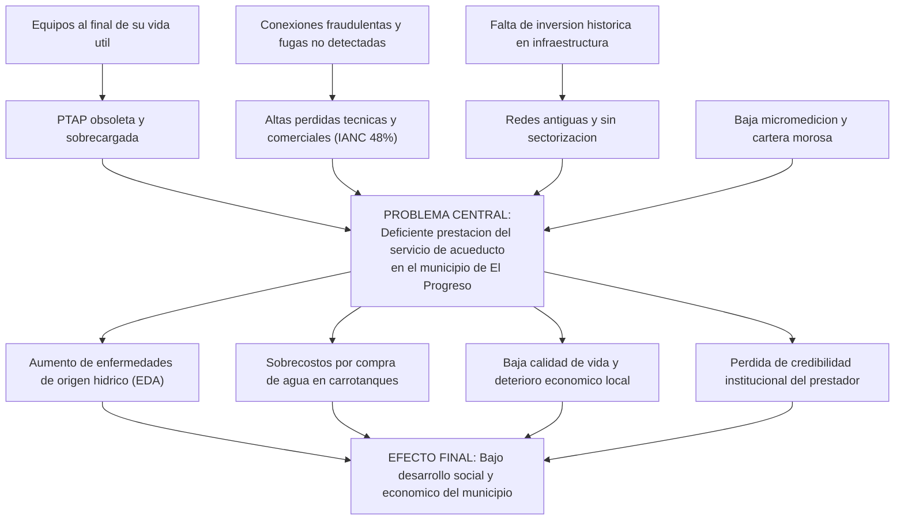
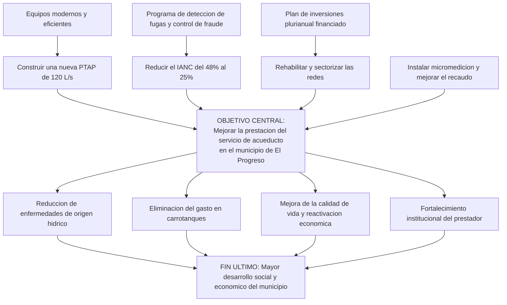

# Proyecto PEPI — Construcción de PTAP y Ampliación del Sistema de Acueducto del Municipio de El Progreso

> **Informe de Preparación y Evaluación de Proyectos de Ingeniería (PEPI)**
> Cifras monetarias en millones de pesos colombianos (COP MM) salvo indicación contraria.

---

## 1. Resumen Ejecutivo

El municipio de **El Progreso** (≈18.000 habitantes, con proyección a 25.000 en 20 años) presenta un déficit crónico en la prestación del servicio de acueducto: cobertura del 78 %, índice de agua no contabilizada (IANC) del 48 % y una planta de tratamiento obsoleta que opera por encima de su capacidad de diseño, lo que genera intermitencia en el suministro y riesgo sanitario.

El proyecto consiste en la **construcción de una nueva Planta de Tratamiento de Agua Potable (PTAP) de 120 L/s**, la **ampliación y rehabilitación de las redes de aducción, conducción y distribución**, la incorporación de **estaciones de bombeo, tanques de almacenamiento y micromedición**. El objetivo central es **garantizar agua potable continua (24 h) y de calidad** al 98 % de la población, reduciendo el IANC al 25 % y eliminando los racionamientos.

La inversión total (**CAPEX**) asciende a **COP 14.000 MM**, financiada en un **60 % con deuda** (banca de desarrollo / FINDETER) y **40 % con equity** (operador especializado + municipio). Con un **WACC de 11,07 %**, el proyecto presenta un **VPN de COP 8.376 MM** y una **TIR del 18,13 %** a nivel de proyecto; desde la óptica del inversionista la **TIR es 24,78 %** con un **VPN de COP 4.698 MM** descontado al costo de equity (15,5 %). Los indicadores confirman que el proyecto es **financiera y económicamente viable**, además de socialmente prioritario por su impacto en salud pública y calidad de vida.

| Indicador | Valor |
|---|---|
| Horizonte de evaluación | 20 años |
| CAPEX | COP 14.000 MM |
| Estructura Deuda / Equity | 60 % / 40 % |
| WACC | 11,07 % |
| VPN del proyecto (@WACC) | COP 8.376 MM |
| TIR del proyecto | 18,13 % |
| VPN del inversionista (@Ke) | COP 4.698 MM |
| TIR del inversionista | 24,78 % |

---

## 2. Árbol de Problemas

**Problema central:** Deficiente prestación del servicio de acueducto en el municipio de El Progreso.

Ver también como diagrama interactivo (mermaid)

---

## 3. Árbol de Objetivos

**Objetivo central:** Mejorar la prestación del servicio de acueducto en el municipio de El Progreso.

Ver también como diagrama interactivo (mermaid)

---

## 4. Matriz de Marco Lógico (MML)

| Nivel | Resumen narrativo | Indicadores verificables | Medios de verificación | Supuestos |
|---|---|---|---|---|
| **FIN** | Contribuir al desarrollo social y económico del municipio mejorando las condiciones de salud pública. | Reducción del 40 % en casos de EDA a 3 años; aumento del IDM municipal. | Reportes de la Secretaría de Salud; estadísticas DANE/SIVIGILA. | Estabilidad política y mantenimiento de la inversión social del municipio. |
| **PROPÓSITO** | Garantizar un servicio de acueducto continuo (24 h), con calidad y cobertura del 98 %. | Cobertura ≥ 98 %; continuidad 24 h; IRCA < 5 % (agua apta); IANC ≤ 25 %. | Informes SUI–SSPD; reportes de calidad IRCA; auditorías al prestador. | La población se conecta y paga la tarifa; no hay variaciones regulatorias adversas. |
| **COMPONENTES** | 1) PTAP de 120 L/s en operación. 2) Redes ampliadas/sectorizadas. 3) Micromedición instalada. 4) Estaciones de bombeo y tanques. | PTAP operando a capacidad; X km de red renovada; N° de micromedidores instalados. | Actas de recibo de obra; pruebas de funcionamiento; inventario de activos. | Disponibilidad de predios y permisos; suministro eléctrico estable. |
| **ACTIVIDADES** | Estudios y diseños; gestión predial y ambiental; construcción civil y montaje; suministro e instalación de equipos y medidores; puesta en marcha. | Avance físico (%) vs. cronograma; ejecución presupuestal CAPEX COP 14.000 MM. | Informes de interventoría; cortes de obra; estados financieros del proyecto. | Cierre financiero (deuda + equity); condiciones climáticas y de orden público normales. |

---

## 5. Solución de Ingeniería Propuesta

La solución integral comprende cuatro frentes técnicos:

**1. Planta de Tratamiento de Agua Potable (PTAP) – 120 L/s.** Planta convencional de tipo compacto-modular con procesos de **coagulación, floculación, sedimentación de alta tasa, filtración rápida y desinfección por cloración**, dimensionada para el caudal máximo diario proyectado a 20 años. Incluye sistema de dosificación automatizado y laboratorio de control de calidad para garantizar un IRCA inferior al 5 % (agua apta para consumo humano según Resolución 2115 de 2007).

**2. Aducción y conducción.** Renovación de la línea de aducción desde la bocatoma y conducción a presión hasta los tanques de almacenamiento, con tubería en PVC/HD de diámetros calculados hidráulicamente (ecuación de Hazen-Williams) para minimizar pérdidas de carga y garantizar presiones de servicio.

**3. Almacenamiento, bombeo y distribución.** Construcción de **tanques de almacenamiento** con capacidad equivalente al 30 % del volumen diario, **estaciones de bombeo** con bombas de alta eficiencia y variadores de frecuencia, y **sectorización de la red de distribución** en distritos hidráulicos para control de presiones y reducción de pérdidas.

**4. Reducción de pérdidas y micromedición.** Instalación masiva de **micromedidores**, macromedición por sector, y un programa permanente de **detección de fugas y control de conexiones fraudulentas**, para bajar el IANC del 48 % al 25 %.

Esta configuración asegura **continuidad 24 h, presión adecuada y calidad normativa**, con un diseño escalable que acompaña el crecimiento poblacional durante el horizonte del proyecto.

---

## 6. Análisis de Viabilidad Financiera y Económica

### 6.1 Estructura de Inversión y Costos (CAPEX / OPEX)

**CAPEX — Inversión inicial: COP 14.000 MM** (año 0)

| Componente | COP MM | % |
|---|---:|---:|
| PTAP (obra civil + equipos) | 6.300 | 45,0 % |
| Ampliación red de aducción y conducción | 2.800 | 20,0 % |
| Estaciones de bombeo y tanques de almacenamiento | 2.100 | 15,0 % |
| Redes de distribución y micromedición | 1.900 | 13,6 % |
| Estudios, diseños e interventoría | 900 | 6,4 % |
| **Total CAPEX** | **14.000** | **100 %** |

**OPEX — Costos de operación (año 1): COP 2.350 MM**, con crecimiento del 4 % anual. Incluye energía de bombeo, productos químicos, personal de operación, mantenimiento de equipos y redes, y costos administrativos/comerciales.

**Ingresos:** tarifa de acueducto (cargo fijo + consumo). Ingreso año 1 = **COP 5.200 MM**, con crecimiento del 4,5 % anual por aumento de cobertura, recuperación de cartera y crecimiento poblacional.

### 6.2 Estructura de Deuda + Equity

| Fuente | Monto (COP MM) | Participación | Costo |
|---|---:|---:|---:|
| Deuda (banca de desarrollo / FINDETER) | 8.400 | 60 % | Kd = 12,5 % |
| Equity (operador + municipio) | 5.600 | 40 % | Ke = 15,5 % |
| **Total** | **14.000** | **100 %** | — |

La deuda se amortiza por el **sistema francés (cuota fija)** a **10 años**, con una cuota anual de **COP 1.517,2 MM**. La tasa de impuesto de renta aplicada es del **35 %**.

### 6.3 Cálculo del WACC (Costo Promedio Ponderado de Capital)

$$WACC = \frac{E}{V}\,K_e + \frac{D}{V}\,K_d\,(1 - t)$$

$$WACC = (0{,}40 \times 0{,}155) + (0{,}60 \times 0{,}125 \times (1 - 0{,}35))$$

$$WACC = 0{,}0620 + 0{,}04875 = \mathbf{0{,}1108 \approx 11{,}07\,\%}$$

### 6.4 Indicadores de Rentabilidad — VPN y TIR

| Óptica | Tasa de descuento | VPN (COP MM) | TIR | Criterio |
|---|---:|---:|---:|---|
| **Proyecto (FCLP)** | WACC = 11,07 % | **8.376** | **18,13 %** | TIR > WACC → **viable** |
| **Inversionista (FCLA)** | Ke = 15,5 % | **4.698** | **24,78 %** | TIR > Ke → **viable** |

Ambos VPN son positivos y ambas TIR superan su respectiva tasa de descuento, por lo que el proyecto **crea valor** tanto a nivel de proyecto como para el accionista. El apalancamiento financiero mejora la rentabilidad del inversionista (24,78 % vs. 18,13 %) gracias al escudo fiscal de los intereses y al menor costo relativo de la deuda.

### 6.5 Flujos de Caja (Proyecto, Inversionistas y Banco)

Cifras en COP MM. *(FC = Flujo de Caja)*

| Año | Ingresos | OPEX | EBITDA | Interés | Amort. deuda | FC Proyecto | FC Inversionista | FC Banco |
|---:|---:|---:|---:|---:|---:|---:|---:|---:|
| 0 | — | — | — | — | — | **-14.000** | **-5.600** | **+8.400** |
| 1 | 5.200 | 2.350 | 2.850 | 1.050 | 467 | 2.098 | 948 | -1.517 |
| 2 | 5.434 | 2.444 | 2.990 | 992 | 526 | 2.188 | 1.018 | -1.517 |
| 3 | 5.679 | 2.542 | 3.137 | 926 | 591 | 2.284 | 1.091 | -1.517 |
| 4 | 5.934 | 2.643 | 3.291 | 852 | 665 | 2.384 | 1.165 | -1.517 |
| 5 | 6.201 | 2.749 | 3.452 | 769 | 748 | 2.489 | 1.241 | -1.517 |
| 6 | 6.480 | 2.859 | 3.621 | 675 | 842 | 2.599 | 1.318 | -1.517 |
| 7 | 6.772 | 2.973 | 3.798 | 570 | 947 | 2.714 | 1.396 | -1.517 |
| 8 | 7.076 | 3.092 | 3.984 | 452 | 1.066 | 2.835 | 1.475 | -1.517 |
| 9 | 7.395 | 3.216 | 4.179 | 318 | 1.199 | 2.961 | 1.555 | -1.517 |
| 10 | 7.728 | 3.345 | 4.383 | 169 | 1.349 | 3.094 | 1.636 | -1.517 |
| 11 | 8.075 | 3.479 | 4.597 | 0 | 0 | 3.233 | 3.233 | 0 |
| 12 | 8.439 | 3.618 | 4.821 | 0 | 0 | 3.379 | 3.379 | 0 |
| 13 | 8.819 | 3.762 | 5.056 | 0 | 0 | 3.532 | 3.532 | 0 |
| 14 | 9.215 | 3.913 | 5.302 | 0 | 0 | 3.692 | 3.692 | 0 |
| 15 | 9.630 | 4.069 | 5.561 | 0 | 0 | 3.859 | 3.859 | 0 |
| 16 | 10.063 | 4.232 | 5.831 | 0 | 0 | 4.035 | 4.035 | 0 |
| 17 | 10.516 | 4.402 | 6.115 | 0 | 0 | 4.220 | 4.220 | 0 |
| 18 | 10.990 | 4.578 | 6.412 | 0 | 0 | 4.413 | 4.413 | 0 |
| 19 | 11.484 | 4.761 | 6.723 | 0 | 0 | 4.615 | 4.615 | 0 |
| 20 | 12.001 | 4.951 | 7.050 | 0 | 0 | 4.827 | 4.827 | 0 |

- **Flujo del Proyecto (FCLP):** mide la rentabilidad de la inversión total independientemente de cómo se financie. Se descuenta al **WACC**.
- **Flujo del Inversionista (FCLA):** flujo que queda para el accionista después de pagar intereses y amortizar deuda. Se descuenta al **Ke**.
- **Flujo del Banco:** desembolsa COP 8.400 MM en el año 0 y recibe la cuota fija (intereses + capital) durante 10 años. Su TIR equivale a Kd = 12,5 %.

> Los flujos y los indicadores fueron calculados con el script `modelo_financiero.py` y exportados a `resultados_modelo.csv`.

---

## 7. Matriz de Riesgos (20 riesgos)

**Escala:** Probabilidad (P) y Severidad/Impacto (I) de 1 a 5. **Nivel de riesgo = P × I.**
Clasificación: **Bajo (1–6)** · **Medio (8–12)** · **Alto (15–25)**.

| # | Riesgo | Tipo | P | I | P×I | Nivel |
|---:|---|---|:--:|:--:|:--:|---|
| 1 | Sobrecostos en la construcción (mayor cantidad de obra) | Financiero | 4 | 4 | 16 | Alto |
| 2 | Retrasos en el cronograma de obra | Operativo | 4 | 3 | 12 | Medio |
| 3 | Demoras en la gestión predial y servidumbres | Legal | 3 | 4 | 12 | Medio |
| 4 | Variación en la tasa de cambio (equipos importados) | Financiero | 3 | 3 | 9 | Medio |
| 5 | Incremento de tasas de interés de la deuda | Financiero | 3 | 4 | 12 | Medio |
| 6 | Recaudo tarifario inferior al proyectado (cartera) | Comercial | 4 | 4 | 16 | Alto |
| 7 | Cambios regulatorios en el marco tarifario (CRA) | Regulatorio | 2 | 4 | 8 | Medio |
| 8 | Contaminación de la fuente de captación | Ambiental | 3 | 5 | 15 | Alto |
| 9 | Reducción del caudal de la fuente (sequía/cambio climático) | Ambiental | 3 | 5 | 15 | Alto |
| 10 | Inadecuada disposición de lodos de la PTAP | Ambiental | 3 | 4 | 12 | Medio |
| 11 | Vertimiento de aguas de lavado sin tratamiento | Ambiental | 3 | 4 | 12 | Medio |
| 12 | Afectación de fauna/flora en zona de obras | Ambiental | 2 | 3 | 6 | Bajo |
| 13 | Fallas o paradas de equipos de bombeo | Operativo | 3 | 3 | 9 | Medio |
| 14 | Interrupción del suministro eléctrico | Operativo | 3 | 4 | 12 | Medio |
| 15 | Accidentes laborales en obra | SST | 3 | 4 | 12 | Medio |
| 16 | Oposición o conflicto con la comunidad | Social | 3 | 3 | 9 | Medio |
| 17 | Vandalismo o robo de infraestructura/medidores | Seguridad | 3 | 2 | 6 | Bajo |
| 18 | Errores en estudios y diseños técnicos | Técnico | 2 | 4 | 8 | Medio |
| 19 | Incumplimiento del contratista (calidad/abandono) | Contractual | 2 | 4 | 8 | Medio |
| 20 | Inflación de costos operativos por encima de lo previsto | Financiero | 3 | 3 | 9 | Medio |

**Resumen:** 4 riesgos Altos, 14 Medios y 2 Bajos. Los riesgos Altos se concentran en sobrecostos, recaudo y los factores ambientales de la fuente.

---

## 8. Intervención de 10 Riesgos (5 ambientales) y Recalificación

Para cada riesgo se define la **medida de intervención** y se realiza la **recalificación** del nivel residual (después de aplicar el control).

> Se intervienen los 10 riesgos prioritarios; **los riesgos 8, 9, 10, 11 y 12 son de tipo ambiental** (5 ambientales, según lo exigido).

### 8.1 Descripción de las intervenciones

| # | Riesgo | Tipo | Intervención propuesta |
|---:|---|---|---|
| 1 | Sobrecostos de construcción | Financiero | Contrato a precio global fijo (EPC), presupuesto con contingencia del 10 % y control de cambios estricto por interventoría. |
| 6 | Bajo recaudo tarifario | Comercial | Campañas de cultura de pago, financiación de cartera, corte por mora y micromedición masiva para facturar consumo real. |
| 5 | Alza de tasas de interés | Financiero | Cobertura con tasa fija / contrato de cobertura (SWAP) en el cierre financiero. |
| 8 | Contaminación de la fuente | **Ambiental** | Protección y reforestación de la ronda hídrica, monitoreo permanente de calidad del agua cruda y barreras de captación. |
| 9 | Reducción de caudal (sequía) | **Ambiental** | Fuente alterna de respaldo, tanques de regulación, programa de uso eficiente del agua (PUEAA) y reuso. |
| 10 | Disposición de lodos | **Ambiental** | Lechos de secado y deshidratación de lodos, con disposición final autorizada y aprovechamiento agrícola cuando aplique. |
| 11 | Vertimiento de aguas de lavado | **Ambiental** | Recirculación de aguas de lavado de filtros y tratamiento previo antes de vertimiento, con permiso ambiental (CAR). |
| 12 | Afectación de fauna/flora | **Ambiental** | Plan de Manejo Ambiental (PMA), compensación forestal y obras en franjas previamente intervenidas. |
| 14 | Interrupción eléctrica | Operativo | Planta eléctrica de respaldo (grupo electrógeno) y contrato de energía con respaldo dual. |
| 15 | Accidentes laborales | SST | Sistema de Gestión SST (Decreto 1072), capacitación, EPP y permisos de trabajo de alto riesgo. |

### 8.2 Matriz de recalificación (riesgo residual)

| # | Riesgo | Tipo | P inicial | I inicial | P×I inicial | Nivel inicial | P residual | I residual | P×I residual | Nivel residual |
|---:|---|---|:--:|:--:|:--:|---|:--:|:--:|:--:|---|
| 1 | Sobrecostos de construcción | Financiero | 4 | 4 | 16 | Alto | 2 | 3 | 6 | Bajo |
| 6 | Bajo recaudo tarifario | Comercial | 4 | 4 | 16 | Alto | 2 | 3 | 6 | Bajo |
| 5 | Alza de tasas de interés | Financiero | 3 | 4 | 12 | Medio | 1 | 3 | 3 | Bajo |
| 8 | Contaminación de la fuente | **Ambiental** | 3 | 5 | 15 | Alto | 2 | 4 | 8 | Medio |
| 9 | Reducción de caudal (sequía) | **Ambiental** | 3 | 5 | 15 | Alto | 2 | 4 | 8 | Medio |
| 10 | Disposición de lodos | **Ambiental** | 3 | 4 | 12 | Medio | 1 | 3 | 3 | Bajo |
| 11 | Vertimiento aguas de lavado | **Ambiental** | 3 | 4 | 12 | Medio | 1 | 3 | 3 | Bajo |
| 12 | Afectación fauna/flora | **Ambiental** | 2 | 3 | 6 | Bajo | 1 | 2 | 2 | Bajo |
| 14 | Interrupción eléctrica | Operativo | 3 | 4 | 12 | Medio | 1 | 4 | 4 | Bajo |
| 15 | Accidentes laborales | SST | 3 | 4 | 12 | Medio | 1 | 4 | 4 | Bajo |

**Efecto de las intervenciones:** los 4 riesgos Altos intervenidos descienden a Medio o Bajo, y la mayoría de los Medios pasan a Bajo. Las medidas ambientales (riesgos 8 a 12) reducen significativamente la exposición, aunque los riesgos asociados a la fuente (8 y 9) permanecen en nivel **Medio** por depender de factores climáticos externos, por lo que requieren **monitoreo y planes de contingencia permanentes**.

---

## 9. Conclusiones

1. El proyecto resuelve una necesidad básica insatisfecha de alto impacto en salud pública y desarrollo local.
2. Es **financieramente viable**: VPN positivo y TIR superior al costo de capital tanto a nivel de proyecto (18,13 % vs. WACC 11,07 %) como de inversionista (24,78 % vs. Ke 15,5 %).
3. El apalancamiento 60/40 es adecuado y mejora la rentabilidad del accionista sin comprometer el servicio de la deuda (cobertura holgada del EBITDA frente a la cuota).
4. La gestión de riesgos —en especial los ambientales— es determinante; con las intervenciones propuestas el perfil de riesgo del proyecto se reduce a niveles mayoritariamente bajos.

---

*Anexos en esta carpeta: `modelo_financiero.py` (modelo de cálculo) y `resultados_modelo.csv` (resultados y flujos detallados).*
